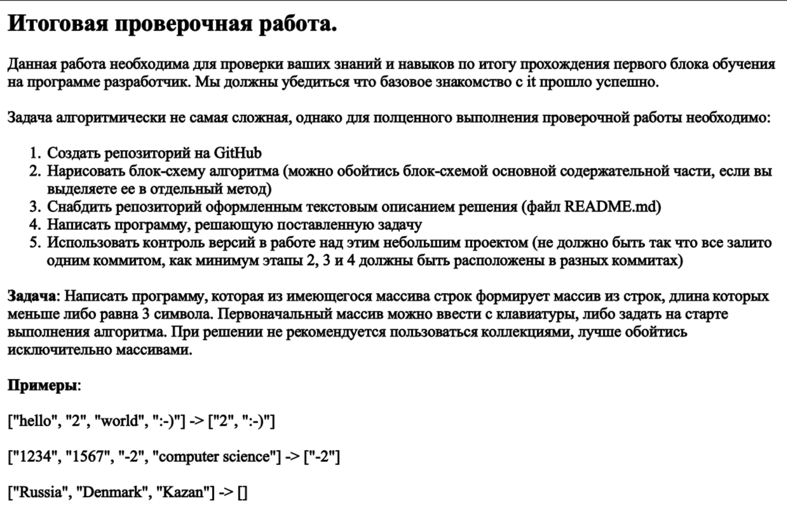
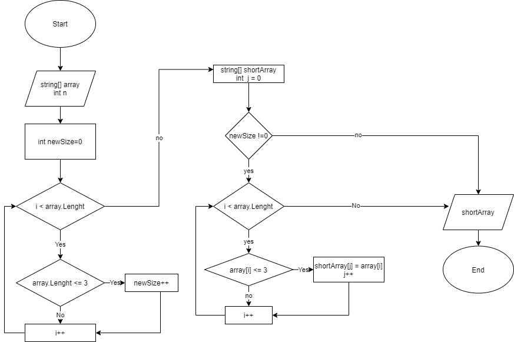

 
<h1> Проверочная работа по итогам первого блока</h2>

## Задача:
Написать программу, которая из имеющегося массива строк, формирует массив из строк, длина которых меньше или равна 3-м символам.

## Решение:

Для решения задачи будет использоваться метод *"GetArrayShortElement"*

Используемые параметры: *string[], int*

Метод проверяет длину массива и возвращает новый массив, состоящий из элементов исходного массива с длинной меньше или равна параметру *int size*.

## Алгоритм работы метода:

1. Инициализируем переменную *int newSize*, используется для длинны возвращаемого массива.
2. Ищем элементы удовлетворяющих условию *string.Lenght* <= 3(по условию).
3. Инициализируем возвращаемый массив *string[] shortArray* и задаем размер *int newSize*.
4. Проверка *newSize* , если *newSize* равна 0, то метод вернет пустой массив.
5. Если *newSize* отличается от 0, то *int j* для элементов возвращаемого массива.
6. Заполняем массив *string[] shortArray* элементами подходящими условию *string.Lenght* <= 3(по условию).
